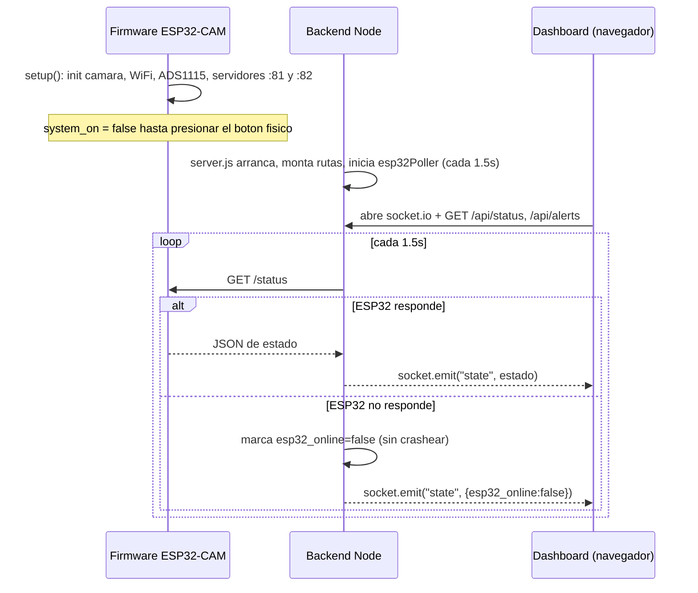
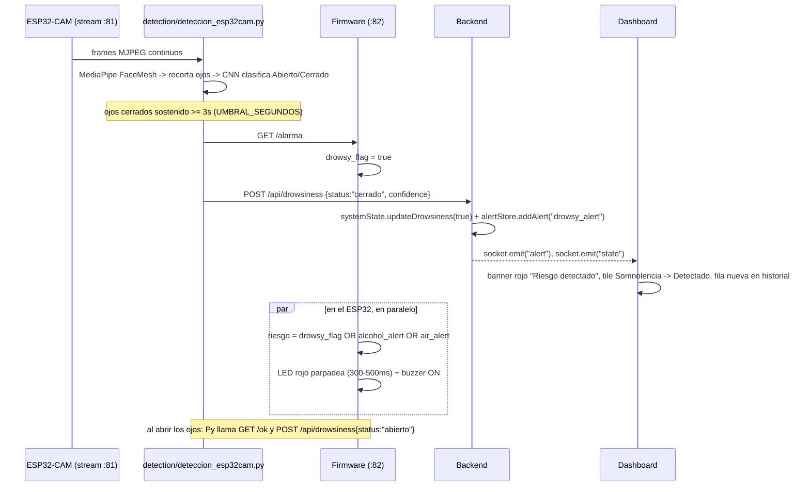
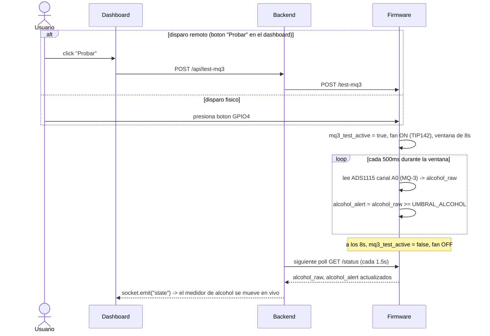
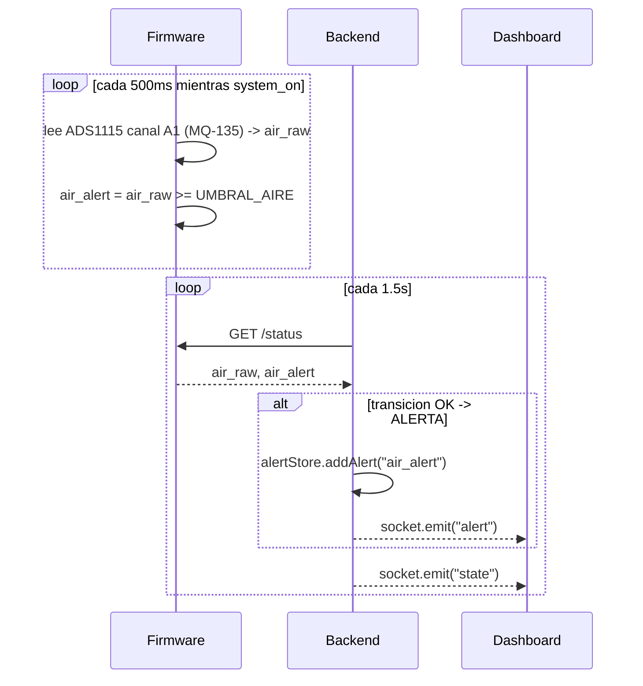
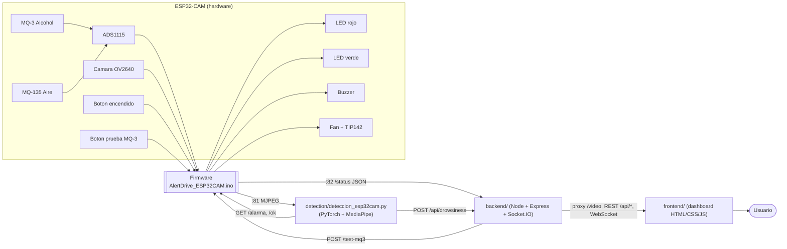

# AlertDrive — Arquitectura y flujos del sistema

Documento de referencia para armar el diagrama de flujos del proyecto. Incluye
la arquitectura completa, el detalle de cada componente, las secuencias de los
flujos principales (ya en diagramas Mermaid listos para pegar) y, al final, un
prompt en texto plano por si preferís generar el diagrama con otra herramienta/IA.

## 1. Arquitectura general

```
┌─────────────────────────────── ESP32-CAM (hardware) ───────────────────────────────┐
│                                                                                       │
│   Camara OV2640          ADS1115 (I2C)         LEDs rojo/verde   Buzzer   Fan+TIP142 │
│        │                  │        │                  │            │         │      │
│        │            MQ-3 (A0)  MQ-135 (A1)            │            │         │      │
│        │                  │        │                  │            │         │      │
│        └──────────────────┴────────┴──────────────────┴────────────┴─────────┘      │
│                                     │                                                │
│                     firmware/esp32-cam/AlertDrive_ESP32CAM.ino                       │
│                     (lee sensores/botones, controla actuadores,                      │
│                      corre 2 servidores HTTP)                                        │
│                                     │                                                │
│              ┌──────────────────────┴───────────────────────┐                       │
│         :81  stream MJPEG                          :82  control + telemetria         │
│         GET /                                       GET  /status  (JSON)              │
│                                                       GET  /alarma /ok /estado         │
│                                                       POST /test-mq3                   │
└──────────────┬────────────────────────────────────────────┬─────────────────────────┘
               │                                             │
               │ frames de video                             │ poll /status cada 1.5s
               │                                             │ + POST /alarma /ok
               ▼                                             ▼
┌──────────────────────────────┐                 ┌───────────────────────────────────┐
│ detection/                    │   POST          │ backend/ (Node + Express +         │
│ deteccion_esp32cam.py         │──/api/drowsiness→│ Socket.IO)                         │
│ (PyTorch CNN + MediaPipe      │                 │  - esp32Poller.js (sondea ESP32)    │
│  FaceMesh: ojos abiertos/     │                 │  - alertStore.js (historial JSON)   │
│  cerrados en tiempo real)     │                 │  - systemState.js (estado en        │
└────────────────────────────────┘                │    memoria, fusiona ESP32+Python)   │
                                                    │  - routes: /api/status, /api/alerts,│
                                                    │    /api/drowsiness, /api/test-mq3,  │
                                                    │    /video (proxy MJPEG)             │
                                                    └───────────────┬─────────────────────┘
                                                                    │ WebSocket (estado en
                                                                    │ vivo) + REST + proxy video
                                                                    ▼
                                                    ┌───────────────────────────────────┐
                                                    │ frontend/ (HTML/CSS/JS + nginx      │
                                                    │ en Docker)                          │
                                                    │  - dashboard.html: banner de estado,│
                                                    │    KPIs, video, sensores,           │
                                                    │    actuadores, historial de alertas │
                                                    └───────────────┬─────────────────────┘
                                                                    │
                                                                    ▼
                                                           Usuario / navegador
```

**Nota sobre Docker:** en producción con `docker compose up`, el `frontend`
corre en su propio contenedor (nginx) que le hace de proxy a `backend` para
`/api/*`, `/video` y `/socket.io/*`. Fuera de Docker, `backend` sirve el
frontend directamente como archivos estáticos en el mismo puerto (`:3000`).

## 2. Componentes

| Componente | Carpeta | Tecnología | Responsabilidad |
|---|---|---|---|
| Firmware | `firmware/esp32-cam/` | C++ / Arduino-ESP32 | Captura video, lee sensores (ADS1115+MQ-3+MQ-135), controla LEDs/buzzer/fan, expone HTTP |
| Detección de somnolencia | `detection/` | Python + PyTorch + MediaPipe | Consume el stream de video, corre el modelo `EyeCNN`, detecta ojos cerrados ≥3s |
| Backend | `backend/` | Node.js + Express + Socket.IO | Agrega el estado del ESP32 y de Python, historial de alertas, sirve el dashboard |
| Frontend | `frontend/` | HTML/CSS/JS plano | Dashboard visual: banner de riesgo, KPIs, video, sensores, actuadores, alertas |
| Entrenamiento (offline, no runtime) | `deteccion_somnolencia.ipynb` | Jupyter/PyTorch | Genero el modelo `eye_cnn_best.pth`; no corre en producción |

## 3. Endpoints (contrato entre componentes)

**Firmware (`:81` stream, `:82` control):**

| Endpoint | Método | Quién lo llama | Qué hace |
|---|---|---|---|
| `/` | GET | `detection/*.py`, backend (proxy `/video`) | Stream MJPEG de la camara |
| `/status` | GET | `backend/esp32Poller.js` | JSON con todo el estado (sensores, LEDs, fan, buzzer) |
| `/alarma` | GET | `detection/*.py` | Marca `drowsy_flag = true` |
| `/ok` | GET | `detection/*.py` | Limpia `drowsy_flag` |
| `/estado` | GET | (compatibilidad) | Estado del buzzer en texto plano |
| `/test-mq3` | POST | `backend/routes/control.js` | Dispara la ventana de prueba de alcoholemia remota |

**Backend (`:3000`):**

| Endpoint | Método | Quién lo llama | Qué hace |
|---|---|---|---|
| `/api/status` | GET | Frontend (carga inicial) | Snapshot del estado agregado |
| `/api/alerts` | GET | Frontend (carga inicial) | Historial de alertas |
| `/api/drowsiness` | POST | `detection/*.py` | Recibe `{status, confidence}`, actualiza estado y log |
| `/api/test-mq3` | POST | Frontend (boton "Probar") | Reenvia al ESP32 `/test-mq3` |
| `/video` | GET | Frontend | Proxy del stream MJPEG del ESP32 |
| WebSocket `state` / `alert` / `alerts` | — | Frontend | Push en vivo del estado y nuevas alertas |

## 4. Flujo — arranque del sistema



## 5. Flujo — detección de somnolencia



## 6. Flujo — prueba de alcoholemia (MQ-3)



## 7. Flujo — calidad de aire (monitoreo continuo)



## 8. Diagrama de arquitectura (para copiar en una herramienta con soporte Mermaid)



## 9. Prompt en texto plano (por si tu herramienta no soporta Mermaid)

Copiá y pegá esto en una IA/herramienta de diagramas (ej. Whimsical, Eraser,
Lucidchart AI, draw.io AI):

> Generá un diagrama de arquitectura de flujo de datos para un sistema IoT
> llamado AlertDrive, con estos nodos y conexiones:
>
> **Nodo 1 — Hardware ESP32-CAM**: contiene una cámara OV2640, un conversor
> ADC ADS1115 conectado a dos sensores de gas (MQ-3 para alcohol y MQ-135
> para calidad de aire), dos LEDs (rojo y verde), un buzzer, un mini fan
> controlado por un transistor TIP142, y dos botones (encendido general y
> prueba de alcoholemia). Todos estos periféricos se conectan al **Nodo 2**.
>
> **Nodo 2 — Firmware del ESP32-CAM**: corre dos servidores HTTP. Uno en el
> puerto 81 que transmite el video de la cámara en formato MJPEG. Otro en el
> puerto 82 que expone un endpoint `/status` con el estado completo en JSON
> (sensores, LEDs, buzzer, fan), y recibe comandos `/alarma`, `/ok` y
> `/test-mq3`.
>
> **Nodo 3 — Script de detección de somnolencia (Python)**: consume el video
> MJPEG del Nodo 2, usa MediaPipe para ubicar los ojos en la cara y una red
> neuronal convolucional (CNN) en PyTorch para clasificar cada ojo como
> abierto o cerrado. Si detecta ojos cerrados durante 3 segundos seguidos,
> envía una señal HTTP `/alarma` al Nodo 2, y en paralelo notifica al Nodo 4
> vía `POST /api/drowsiness`.
>
> **Nodo 4 — Backend (Node.js)**: consulta periódicamente (cada 1.5 segundos)
> el endpoint `/status` del Nodo 2 para leer sensores y actuadores, recibe las
> notificaciones de somnolencia del Nodo 3, mantiene un historial de alertas,
> y transmite todo el estado en tiempo real vía WebSocket al Nodo 5. También
> actúa de proxy del video para que el navegador no le hable directo al
> Nodo 2.
>
> **Nodo 5 — Dashboard web (frontend)**: recibe el estado en tiempo real del
> Nodo 4 y muestra: un banner de estado general (normal o riesgo), el video en
> vivo, medidores de nivel de alcohol y calidad de aire, indicadores de LEDs y
> actuadores, y un historial de alertas. El usuario final interactúa con este
> nodo desde el navegador.
>
> El flujo de datos principal es: Hardware → Firmware → (Script Python +
> Backend) → Dashboard → Usuario. El flujo de comandos es inverso en algunos
> casos: el Dashboard puede disparar una prueba de alcoholemia que viaja
> Backend → Firmware → Hardware (fan + sensor).

## 10. Estructura de carpetas (referencia rápida)

```
alertdrive-codigo/
├── firmware/esp32-cam/AlertDrive_ESP32CAM.ino
├── detection/
│   ├── deteccion_esp32cam.py
│   ├── model/eye_cnn_best.pth
│   └── requirements.txt / requirements-docker.txt
├── backend/
│   └── src/{server.js, config.js, state/, services/, routes/}
├── frontend/
│   ├── index.html, css/dashboard.css
│   └── js/{gauges.js, alerts-log.js, demo.js, socket-client.js}
├── docker-compose.yml  (backend + frontend + detection)
└── deteccion_somnolencia.ipynb  (entrenamiento, no runtime)
```
